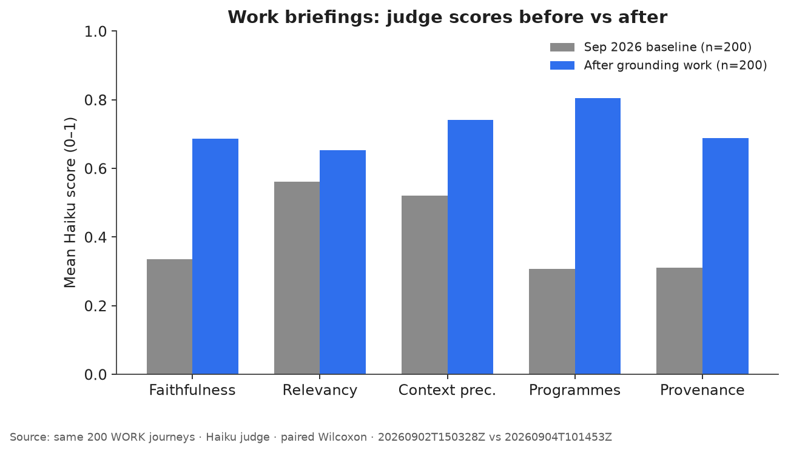
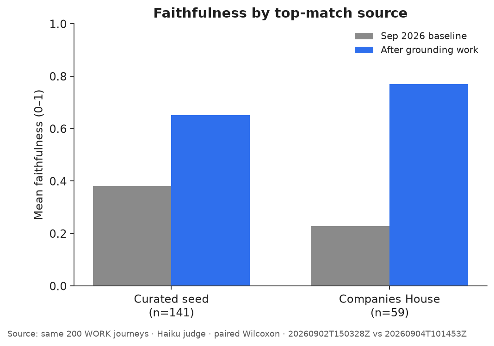

# MatchKite

Matches school, college, and university leavers to **top 3 Gloucestershire and Bristol employers**, with career-group clustering, training routes, and personalised RAG briefings.

**Status:** non-commercial **live demo** (open-source). Not an official careers service.  
**Licence:** [MIT](LICENSE) · **Data attribution:** [DATA.md](DATA.md) (includes DfE / OGL notice).  
**Product UI:** Next.js [`web/`](web/) + FastAPI [`api/`](api/).

**Deploy:** see [docs/DEPLOY.md](docs/DEPLOY.md) (Vercel frontend + Docker API on a small VPS).

## Quick start (product)

```bash
.venv\Scripts\activate
pip install -r requirements.txt

# Terminal 1 — API
.venv\Scripts\uvicorn api.main:app --reload --port 8000

# Terminal 2 — web
cd web
copy .env.local.example .env.local
npm run dev
```

Open http://localhost:3000. Optional LLM briefings: copy `.env.example` → `.env` and set `OPENAI_API_KEY`.

Rebuild FAISS / personas after data changes:

```bash
.venv\Scripts\python scripts/07_build_faiss_corpus.py
.venv\Scripts\python scripts/08_build_persona_model.py
```

## Offline research notebooks

Notebooks under `notebooks/` support exploration and ETL. **Canonical product rebuilds use `scripts/` (01–08).**

| Notebook | Role |
|----------|------|
| `00_environment_setup` | Deps + MiniLM provision |
| `01_data_consolidation` | EDA; prefer `scripts/02_build_company_masters.py` for masters |
| `02_feature_engineering` | Research notebook; **live embeddings via** `scripts/05_build_company_embeddings.py` |
| `03_clustering` | Exploratory; prefer `scripts/08_build_persona_model.py` |
| `04_recommender_system` | Research notebook; cosine blend now lives in `matching.py` |
| `05_rag_briefing` | Samples; prefer `scripts/07_build_faiss_corpus.py` |

| # | Script | Purpose |
|---|--------|---------|
| 01 | `scripts/01_fetch_companies_house_employers.py` | GL employer refresh from Companies House |
| 02 | `scripts/02_build_company_masters.py` | Seed + vacancies → `app/app_data/` masters |
| 03 | `scripts/03_build_verified_programmes.py` | Curated verified employer programmes for briefings |
| 04 | `scripts/04_export_rag_corpus.py` | Company / opportunity corpus with Source lines |
| 05 | `scripts/05_build_company_embeddings.py` | MiniLM company vectors for live match blend |
| 06 | `scripts/06_build_catalogue_embeddings.py` | MiniLM course / military catalogue vectors |
| 07 | `scripts/07_build_faiss_corpus.py` | Evidence FAISS index |
| 08 | `scripts/08_build_persona_model.py` | K-Means personas joblib |

Optional (only when that data changes):

- **2.1–2.4** website hygiene after 02: `scripts/02_1_export_missing_websites.py` → `scripts/02_2_apply_manual_websites.py` → `scripts/02_3_apply_curated_vacancy_websites.py` → `scripts/02_4_remove_companies_without_website.py`
- **6.1** NCS course seed, then re-run 06: `scripts/06_1_build_courses_seed_from_ncs.py`
- **8.1–8.3** persona mix, then re-run 08: `scripts/08_1_fetch_external_clustering_data.py` → `scripts/08_2_curate_leaver_dataset.py` → `scripts/08_3_merge_live_into_curated.py`
- **09** live apprenticeship cache (Display Advert API key): `scripts/09_fetch_open_apprenticeships.py`
- **10** live Reed jobs cache (Jobseeker API key): `scripts/10_fetch_reed_jobs.py`

Judge / gold-set eval stays in `scripts/eval/` and `scripts/run_ai_eval.py`.

## Project structure

```
MatchKite/
├── web/                       # Next.js product UI
├── api/                       # FastAPI matcher + briefings + live learning
├── app/app_data/              # Runtime CSVs, persona joblib, FAISS
├── src/glos_recommender/      # Matching, personas, briefing, RAG, plans
│   ├── scoring.py             # Shared catalogue score helpers
│   └── etl/                   # Vacancies / Companies House rebuild helpers
├── data/taxonomy/             # Intake + pathways + persona priors
├── data/seed/                 # Curated employers
├── data/curated/              # Clustering train/holdout
├── data/live/                 # Anonymous match events (gitignored)
├── scripts/                   # Canonical rebuilds
├── notebooks/                 # Research / EDA (02 & 04 parked)
├── archive/                   # Old Streamlit prototype
└── docs/                      # Deploy notes + AI safety figures
```

Archived Streamlit UI: [`archive/streamlit_app.py`](archive/streamlit_app.py) (optional; not the product path).

## Employer data sources

1. **Seed** (`data/seed/`) — curated Gloucestershire priority employers (`priority_employer=1`), plus public-sector anchors (GCHQ, CGI, …).
2. **Companies House** — free BasicCompanyData snapshot; top GL registered-office employers by accounts-category size proxy (`scripts/01_fetch_companies_house_employers.py`).
3. **Find an Apprenticeship** — DfE underlying vacancies file from Explore Education Statistics (OGL). `scripts/02_build_company_masters.py` filters `GL*` postcodes, aggregates by employer, and merges (seed wins on name clash). The zip is stored under `data/raw/` (gitignored).

Full attribution → **[DATA.md](DATA.md)**.

> Contains public sector information licensed under the [Open Government Licence v3.0](https://www.nationalarchives.gov.uk/doc/open-government-licence/version/3/).  
> Source: Department for Education — Apprenticeships / Explore Education Statistics (underlying vacancies).  
> Companies House free company data product also used under OGL terms.

```bash
.venv\Scripts\python scripts/01_fetch_companies_house_employers.py --top 100 --rebuild
.venv\Scripts\python scripts/02_build_company_masters.py
.venv\Scripts\python scripts/03_build_verified_programmes.py
.venv\Scripts\python scripts/04_export_rag_corpus.py
.venv\Scripts\python scripts/05_build_company_embeddings.py
.venv\Scripts\python scripts/06_build_catalogue_embeddings.py
.venv\Scripts\python scripts/07_build_faiss_corpus.py
.venv\Scripts\python scripts/08_build_persona_model.py
```

Restart the API after rebuilding so it reloads masters / embeddings / FAISS / persona model.

## Matching score (live API)

```
hybrid =
  0.35 * sector_overlap
+ 0.20 * entry_route_fit
+ 0.20 * text_overlap
+ 0.15 * psych_role_fit
+ 0.10 * hiring_signal

# when app/app_data/company_embeddings.npz exists:
final_score = 0.7 * hybrid + 0.3 * cosine_sim(MiniLM)
```

Build embeddings after refreshing company masters:

```bash
.venv\Scripts\python scripts/05_build_company_embeddings.py
```

Restart the API so it reloads the matrix. Without the `.npz` file, matching falls back to hybrid-only.

## AI safety

Work-mode briefings are scored with **Claude Haiku** on **200** synthetic journeys (50 per stratum: no quals, school leaver, FE leaver, graduate). Same journey file, same judge (`v1-haiku-json-5`). This is **not** the 10-case gold set in `scripts/run_ai_eval.py`. OpenAI is never used as the judge.

**Before** is the locked 2 Sep 2026 run (`data/eval/runs/20260902T150328Z`). **After** is 4 Sep 2026 (`data/eval/runs/20260904T101453Z`) on the grounded briefing pipeline.

| Metric | Before | After | Mean Δ (95% CI) |
| --- | ---: | ---: | --- |
| Faithfulness | 0.34 | 0.69 | +0.35 (0.33–0.38) |
| Answer relevancy | 0.56 | 0.65 | +0.09 (0.08–0.11) |
| Context precision | 0.52 | 0.74 | +0.22 (0.21–0.24) |
| Programmes grounding | 0.31 | 0.80 | +0.50 (0.46–0.53) |
| Provenance cues | 0.31 | 0.69 | +0.38 (0.35–0.40) |



On the same 200 journeys, mean **faithfulness** rose from 0.34 to 0.69 (mean Δ = +0.35, 95% bootstrap CI +0.33 to +0.38). A Wilcoxon signed-rank test on paired scores rejected no change (*p* < 0.0001, *n* = 200, rank-biserial *r* = 0.97; 188 improved, 3 worse, 9 ties). Relevancy, context precision, programmes grounding, and provenance also rose (Holm-adjusted *p* < 0.0001).

The original hole was **Companies House** rows (faithfulness 0.23 vs 0.38 on curated seed). After the template path, CH is 0.77 and seed is 0.65:



**What changed**

1. Thin Companies House / vacancy / seed-without-programmes rows skip OpenAI and use a three-section template (location + matcher tags only — no invented schemes).
2. Employer RAG is strategy-only; matcher tags are not written as “they offer”.
3. **Why** and **Training routes** are filled in code (overlapping interests + verified programmes only). OpenAI may write **What to build**.
4. What to build is restricted to overlapping interests; extra-sector project ideas are dropped.
5. Public match cards do not say “Often hiring”; seed/vacancy marketing blurbs are not shown; a vacancy row that duplicates a seed employer (for example Aviva) is hidden.

This demo is **careers guidance**, not a jobs board. Check official careers pages. The judge can still dock packed top-3 employer names that are not in the retrieved contexts.

Re-run:

```bash
.venv\Scripts\python scripts/eval/run_journeys.py
.venv\Scripts\python scripts/eval/score_ragas.py --run-dir latest
.venv\Scripts\python scripts/eval/compare_runs.py --before data/eval/runs/20260902T150328Z --after latest --docs-dir docs/eval
```

